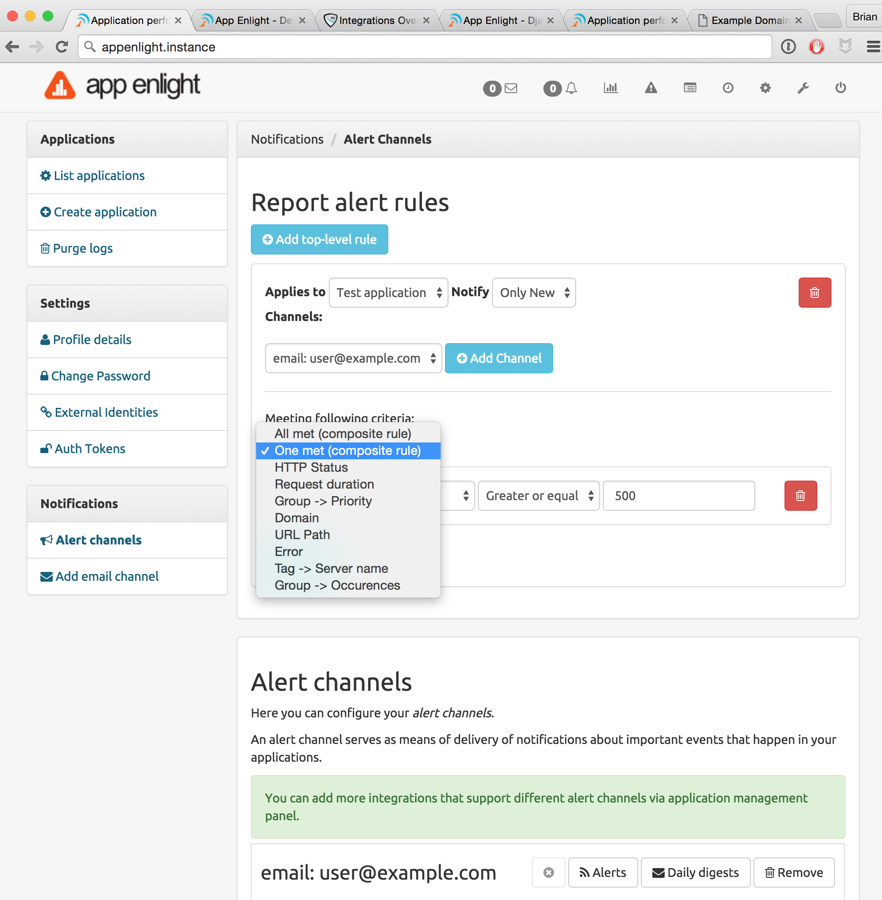

Alert Channels
==============

You can configure |RAE| to send alerts to multiple channels.

Email Channel
-------------

To configure an email alert channel and the rules criteria, use the following
steps:

1. Select :menuselection:`Settings --> Add Email Channel`
2. Add your email address.
3. On the :guilabel:`Alert channels` page, configure the notification rules
   based on the following criteria.

   .. hlist::

       - Application
       - HTTP Status
       - Request Duration
       - Priority
       - Domain
       - URL Path
       - Error
       - Tag
       - Group

Additional Channels
-------------------

You can configure further channels using the following steps:

1. Select :menuselection:`Settings --> List Applications`
2. Click :guilabel:`Integrations` beside the application for which you wish to
   configure alerts.

The following integrations are available, and you can read more in the
:ref:`integrations` section:

.. hlist::

    - Bitbucket
    - Campfire
    - Flowdock
    - github
    - Hipchat
    - Jira
    - Slack
    - webhooks
