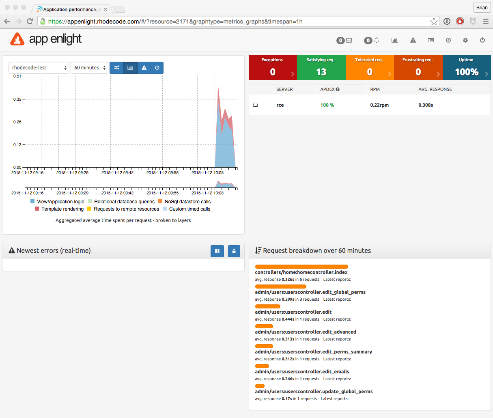

.. _connect-enterprise:

How To Use |AE| to Monitor |RCE|
================================

.. raw:: html

   From the landing page, the <i class="fa fa-cog "></i> icon takes you to
   the settings page.  

1. From the interface, create an application for |AE| to monitor:
   :menuselection:`Settings --> Create Application`
2. Add in your |RCE| instance details.
3. Take note of the Public and Private API keys on the application page. You
   will need to add the private key to your |RCE| configuration file.

|RCE| Side Of The Setup
-----------------------

Once you have your |AE| account details, configure the |RCE|
:file:`home/{user}/.rccontrol/{instance-id}/rhodecode.ini` file with the
following details to set up the connection between the two systems.

.. tip::

    The section below should already be present in your configuration file if
    running a recent version of |RCE|.

* Enable the |AE| connection by setting ``appenlight = true``.
* Set your |AE| URL using the ``appenlight.server_url = URL`` option.
* Set your |AE| |authtoken| using the ``appenlight.api_key = TOKEN`` option.

.. code-block:: ini
   :emphasize-lines: 10,12,13

    ###################################
    ## ERROR AND LOG HANDLING SYSTEM ##
    ###################################

    ## Appenlight is tailored to work with RhodeCode, see
    ## http://appenlight.com for details how to obtain an account
    ## you must install python package `appenlight_client` to make it work

    ## appenlight enabled
    appenlight = false

    appenlight.server_url = https://api.appenlight.com
    appenlight.api_key = YOUR_PRIVATE_API_KEY

    ## TWEAK AMOUNT OF INFO SENT HERE

    ## enables 404 error logging (default False)
    appenlight.report_404 = false

    ## time in seconds after request is considered being slow (default 1)
    appenlight.slow_request_time = 1

    ## record slow requests in application
    ## (needs to be enabled for slow datastore recording and time tracking)
    appenlight.slow_requests = true

    ## enable hooking to application loggers
    appenlight.logging = true

    ## minimum log level for log capture
    appenlight.logging.level = WARNING

    ## send logs only from erroneous/slow requests
    ## (saves API quota for intensive logging)
    appenlight.logging_on_error = false

    ## list of additonal keywords that should be grabbed from environ object
    ## can be string with comma separated list of words in lowercase
    ## (by default client will always send following info:
    ## 'REMOTE_USER', 'REMOTE_ADDR', 'SERVER_NAME', 'CONTENT_TYPE' + all keys that
    ## start with HTTP* this list be extended with additional keywords here
    appenlight.environ_keys_whitelist = ""

    ## list of keywords that should be blanked from request object
    ## can be string with comma separated list of words in lowercase
    ## (by default client will always blank keys that contain following words
    ## 'password', 'passwd', 'pwd', 'auth_tkt', 'secret', 'csrf'
    ## this list be extended with additional keywords set here
    appenlight.request_keys_blacklist = ""

    ## list of namespaces that should be ignores when gathering log entries
    ## can be string with comma separated list of namespaces
    ## (by default the client ignores own entries: appenlight_client.client)
    appenlight.log_namespace_blacklist = ""

Verifying The Setup
-------------------

Once |RCE| and |AE| are working together you will see the monitoring begin on
your |AE| dashboard when you start carrying out actions in |RCE|.

.. _sign up for an account: https://appenlight.rhodecode.com/
.. _here: https://appenlight.rhodecode.com/page/api/main
