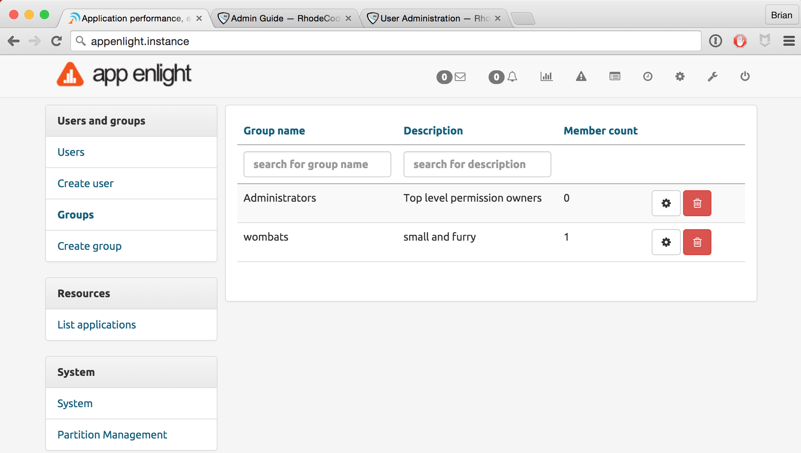

.. _user-perms:

User Administration
===================

.. raw:: html

    From the landing page, them <i class="fa fa-wrench "></i> icon takes you
    to the admin panel. User management is carried out using the following:
      

- User Groups
- Users

Create A User Group
-------------------

1. Select :menuselection:`Admin --> Create Group`
2. Set the :guilabel:`Group Name` and :guilabel:`Description`
3. Click :guilabel:`Add Group`

Add/Remove Users From Group
---------------------------

1. Select :menuselection:`Admin --> Groups --> Settings`
2. From the :guilabel:`User List` pane, add or remove users.

Create/Edit A User
------------------

1. Select :menuselection:`Admin --> Create User`
2. Set the following user details:

    - :guilabel:`Username`
    - :guilabel:`Password`
    - :guilabel:`Email Address`

3. Click :guilabel:`Add Group`

Setting Permissions
-------------------

Permissions are set for User Groups and Users on a per application basis. To
set their permissions to each one, use the following steps:

1. Select :menuselection:`Admin --> List Applications`
2. Click the :guilabel:`Settings` button beside the application of your choice.
3. From the :guilabel:`Permissions` panel, give the User Group or User access
   to the application, and set their level of access from the following options:

    - :guilabel:`View`
    - :guilabel:`Update Reports`

4. Click :guilabel:`Give permission`
