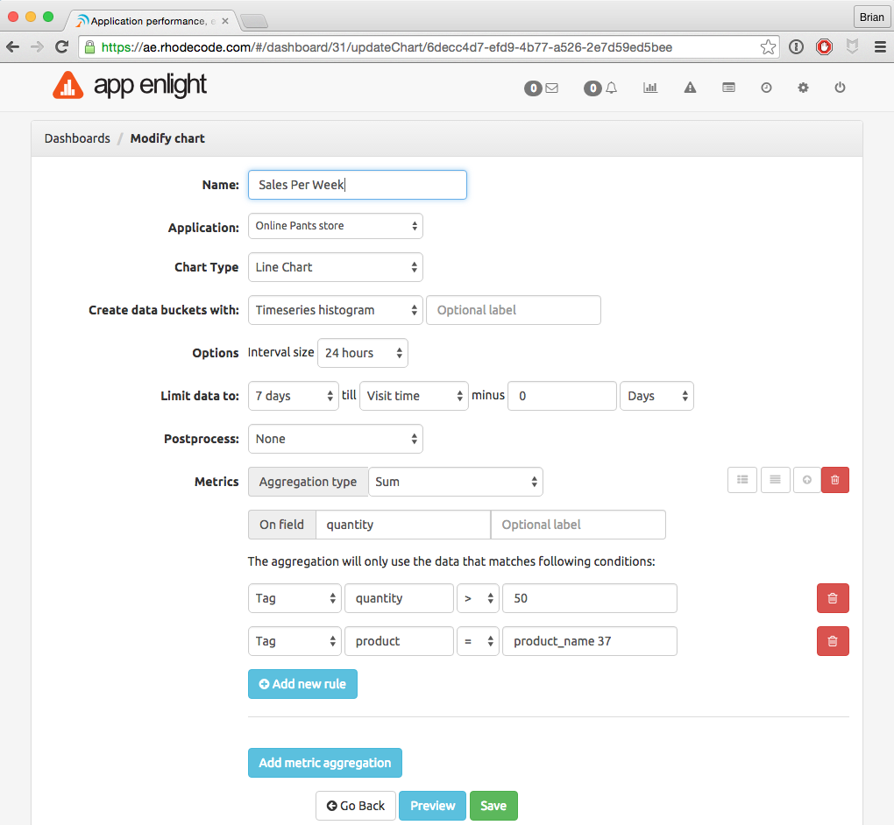

Creating Custom Dashboards
==========================

.. important::

   To generate custom dashboards you need to use the |RAE|
   `Logging API`_ to export the data you want to chart. See the example
   scripts for doing this in the :ref:`log-script-eg` section.

To create a custom dashboard, use the following steps.

1. From the |RAE| home page, select
   :menuselection:`Charts -->  Custom Dashboards --> Create Dashboard`
2. Add a name in the :guilabel:`Dashboard title` files and save the chart.
   Then you can click on the :guilabel:`Configure Chart` button to
   start creating it.
3. Configure the following basic chart settings:

   - The :guilabel:`Application` from which the data is being monitored.
   - Select the :guilabel:`Chart Type`.
   - Choose between a :guilabel:`Timeseries histogram` or a :guilabel:`Terms`
     based chart.
   - Select the :guilabel:`Aggregation type` from the drop down menu

4. From here on, it depends on what data is being used. In the following
   example, this is being calculated:

   - the sum of sales in which the quantity of items sold was over 50
   - for *product_name 37*
   - over the last 7 days

.. _Logging API: https://appenlight.rhodecode.com/page/api/0.5/logs

