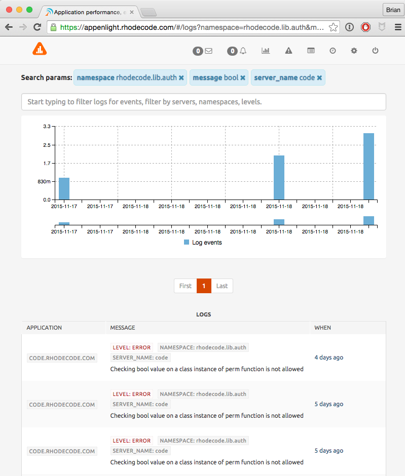

Log Monitoring Overview
=======================

|RAE| monitors the logs generated by your application and feeds these into a
log stream. You can view this log stream by clicking on the log icon on the
main landing page.

Filtering The Log Feed
----------------------

.. raw:: html

   From the landing page, the <i class="fa fa-list-alt "></i> icon takes you to
   the logs page. To filter the log feed, use the following steps.

1. Go to the logs page by clicking on the icon.
2. In the search parameters field, enter a filtering parameter, or multiple
   filtering parameters.
3. |RAE| will automatically update the logs listing to return only those logs
   that match your criteria.

This is a list of the available filtering parameters:

.. hlist::
   :columns: 4

   * *Application*
   * *End Date*
   * *Level*
   * *Request ID*
   * *Message*
   * *Namespace*
   * *Start Date*
   * *Tag*

