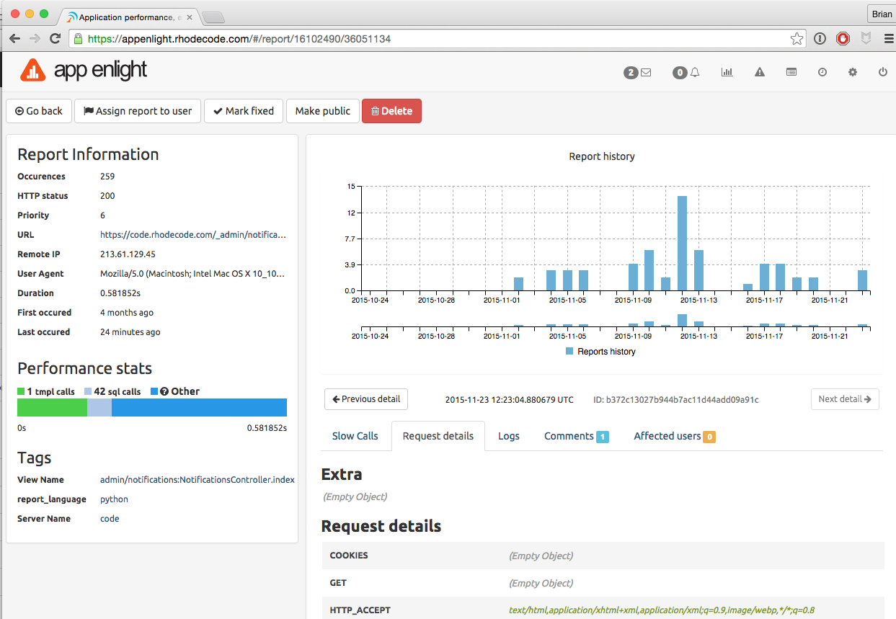

Error Reports Overview
======================

|RAE| monitors your application and generates a list of reports based on
operations or views that generate errors. You can view this
report list by clicking the error report icon on the main landing page.

Filtering Error Reports
-----------------------

.. raw:: html

   From the landing page, the <i class="fa fa-exclamation-triangle"></i> icon
   takes you to the reports page. To filter the reports feed, use the
   following steps.

1. Go to the reports page by clicking on the icon.
2. In the search parameters field, enter a filtering parameter, or multiple
   filtering parameters.
3. |RAE| will automatically update the reports listing to return only those
   that match your criteria.

This is a list of the available filtering parameters:

.. hlist::
   :columns: 4

   * *Application*
   * *Domain*
   * *Error*
   * *End Date*
   * *HTTP Status*
   * *Minimum Occurrences*
   * *Priority*
   * *Request ID*
   * *Status*
   * *Start Date*
   * *Tag*
   * *View Name*

Viewing Reports
---------------

To open a report, click on the report error message on the reports list page.
This will open the full details. From this page you can manage the report,
for more information, see the :ref:`manage-reports` page.

